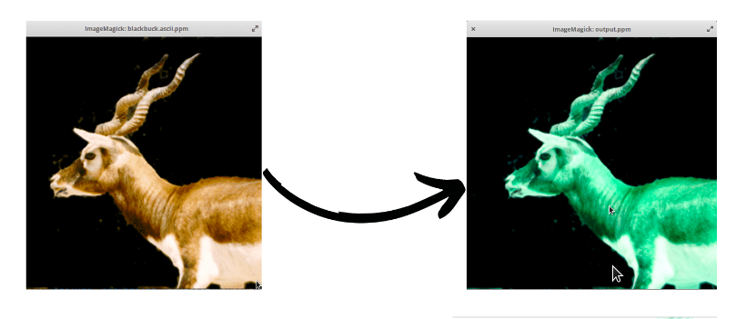
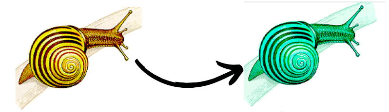
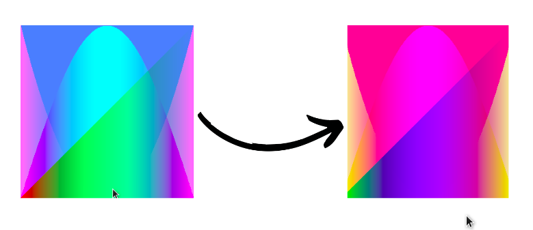

## image-reader-cpp

This program reads a `.ppm` file and converts it from RGB to BRG format. Both the input and output files are viewable on a GIMP application.

To run the program:
- `g++ main.cpp PPM.cpp`
- `./a.out inputfile.ppm`

An output `ppm` file, `outfile.ppm` will be generated, which has the BRG format.

